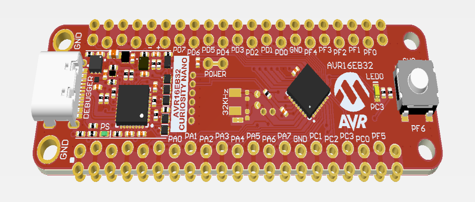
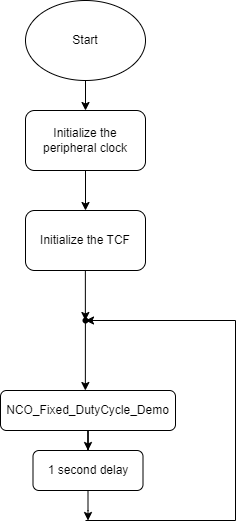
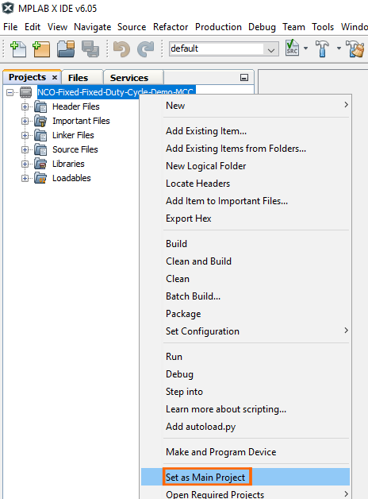
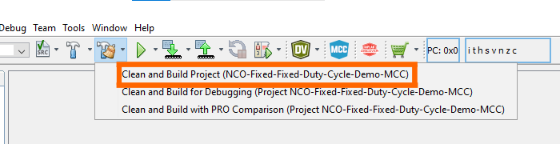
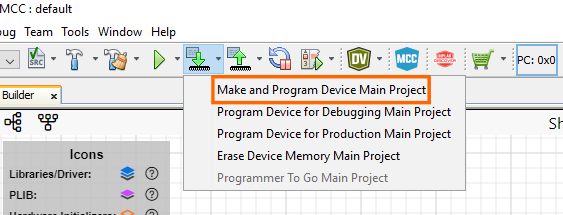
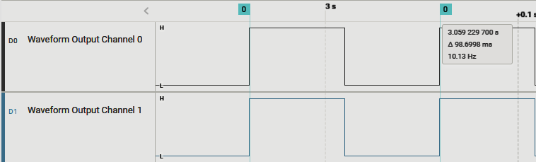
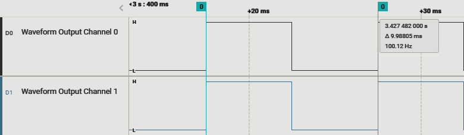
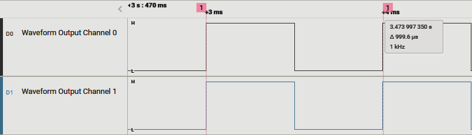
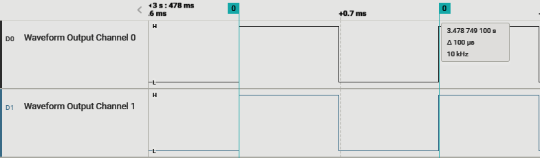
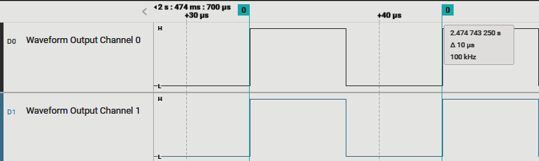

[](https://www.microchip.com)

##  Generate Two Variable-Frequency Signals in NCO-Fixed Mode Using  the TCF
The example shows how to set the TCF to generate Two Variable-Frequency signals, ranging from 10 Hz to 100 khz, with one magnitude step change. The TCF is operating in Numerically Controlled Oscillator (NCO) mode, and has an important advantage over classical Pulse-Width Modulation (PWM) control, as it offers liniar ferquency regulation.


## Related Documentation
More details and code examples on the AVR16EB32 can be found at the following links:
- [TBxxxx - Getting Started with Timer/Counter Type F (TCF)](insert url link here)
- [AVR<sup>®</sup> EB Product Page](https://www.microchip.com/en-us/product/AVR16EB32)
- [AVR<sup>®</sup> EB Code Examples on GitHub](insert url link here)

## Software Used
- [MPLAB® X IDE v6.15 or newer](https://www.microchip.com/en-us/tools-resources/develop/mplab-x-ide)
- [AVR-Ex DFP-2.7.184 or newer Device Pack](https://packs.download.microchip.com/)
- [MPLAB® XC8 compiler v2.45](https://www.microchip.com/en-us/tools-resources/develop/mplab-xc-compilers/downloads-documentation#XC8)

## Hardware Used
- [AVR<sup>®</sup> EB Curiosity Nano](https://www.microchip.com/en-us/product/AVR16EB32)

## Setup
The AVR16EB32 Curiosity Nano Development Board is used as a test platform.
<br>

## Functionality
<br>After the peripheral clock and TCF are initialized, the ```NCO_Fixed_DutyCycle_Demo``` function is called in an infinite loop. 

The timer is started with a frequency of 10 Hz and run up until it reaches 100 KHz.
At the end the timer is stopped and frequency is reseted to 10 Hz.

```
void NCO_Fixed_DutyCycle_Demo(void)
{   
    /* Enable the TCF */
    TCF0_Start();
    
    /* Delay for 600 ms */
   _delay_ms(600);
   
   /* Load the CMP register with a frequency of 100 Hz */
   TCF0_CompareSet(TCF0_NCOFD_HZ_TO_INCREMENT(100, 20000000, 1));
   
    /* Delay for 60 ms */
   _delay_ms(60);
   
   /* Load the CMP register with a frequency of 1 KHz */
   TCF0_CompareSet(TCF0_NCOFD_HZ_TO_INCREMENT(1000, 20000000, 1));
   
    /* Delay for 6 ms */
   _delay_ms(6);
   
   /* Load the CMP register with a frequency of 10 KHz */
   TCF0_CompareSet(TCF0_NCOFD_HZ_TO_INCREMENT(10000, 20000000, 1));
   
    /* Delay for 600 us */
   _delay_us(600);
   
   /* Load the CMP register with a frequency of 100 KHz */
   TCF0_CompareSet(TCF0_NCOFD_HZ_TO_INCREMENT(100000, 20000000, 1));
   
    /* Delay for 60 us */
   _delay_us(60);
   
    /* Stop the TCF */
   TCF0_Stop();
   
   /* Load the CMP register with a frequency of 10 Hz */
   TCF0_CompareSet(TCF0_NCOFD_HZ_TO_INCREMENT(10, 20000000, 1));
}

```
<br>


## Operation

 1. Connect the board to the PC.

 2. Open the  **TCF_NCO_Fixed_Duty_Cycle.X** solution in MPLAB<sup>®</sup> X IDE.

 3. Right click the project and select **Set as main project**.

<br>

 4. Build the  **TCF_NCO_Fixed_Duty_Cycle.X**  project: click on **Clean and Build Project**.

<br>

 5. Program the project to the board, click Make and Program Device.

<br>


## Results

The logic analyzer captures below shows how the TCF generates a waveform signal in NCO Fixed Duty Cycle (FDC) mode.


<br>Result 1: two identical signals are generated with a frequency of 10 Hz and duty cycle of 50%.
<br>

<br>Result 2: two identical signals are generated with a frequency of 100 Hz and duty cycle of 50%.
<br>

<br>Result 3: two identical signals are generated with a frequency of 1 kHz and duty cycle of 50%.
<br>

<br>Result 4: two identical signals are generated with a frequency of 10 kHz and duty cycle of 50%.
<br>

<br>Result 5: two identical signals are generated with a frequency of 100 kHz and duty cycle of 50%.
<br>


## Summary

This example shows how to create a bare metal project using the TCF peripheral of AVR16EB32. The TCF was configured to generate two PWM output signals on the default TCF output pins. The PWM sequence changes the frequency from 10 Hz to 100 KHz with one magnitude step maintaining 50% duty cycle. The measured output confirms the expected result.
