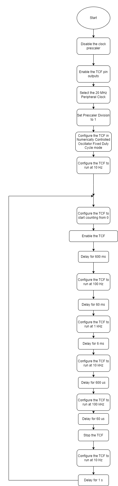

[](https://www.microchip.com)

## Use case 1: Generate Two Variable-Frequency Signals in NCO-Fixed Mode using the TCF

Below is an example of how to set TCF to generate Two Variable-Frequency signals

## Related Documentation
More details and code examples on the AVR16EB32 can be found at the following links:
- [TBxxxx - Getting Started with Timer/Counter Type F (TCF)](insert url link here)
- [AVR16EB32 Product Page](insert url link here)
- [AVR16EB32 Code Examples on GitHub](insert url link here)

## Software Used
- [MPLAB X IDE v6.15 or newer](https://www.microchip.com/en-us/tools-resources/develop/mplab-x-ide)
- [AVR-Ex_DFP-2.5.184 or newer Device Pack](insert url link here)

## Hardware Used
- AVR16EB32 Cnano [(AVR16EB32)](insert url link here)

## Setup
The AVR16EB32 Cnano Development Board is used as test platform.
<br>


<br>After we initialize the peripheral clock and the TCF, we call in an infinite loop the NCO_Fixed_DutyCycle_Demo function.

The purpose of this function is to change the frequency at which the timer operates. We first start the timer with a frequency of 100 Hz and run up until we reach 100 KHz.

At the end we stop the timer and reset the frequency to default.

```
void NCO_Fixed_DutyCycle_Demo(void)
{   
   TCF0_Start();
   _delay_ms(600);
   TCF0_CompareSet(TCF0_NCOFD_HZ_TO_INCREMENT(100, 20000000, 1));
   _delay_ms(60);
   TCF0_CompareSet(TCF0_NCOFD_HZ_TO_INCREMENT(1000, 20000000, 1));
   _delay_ms(6);
   TCF0_CompareSet(TCF0_NCOFD_HZ_TO_INCREMENT(10000, 20000000, 1));
   _delay_us(600);
   TCF0_CompareSet(TCF0_NCOFD_HZ_TO_INCREMENT(100000, 20000000, 1));
   _delay_us(60);
   TCF0_Stop();
   TCF0_CompareSet(TCF0_NCOFD_HZ_TO_INCREMENT(10, 20000000, 1));
}

```
<br>


## Operation

 1. Connect the board to the PC.

 2. Open the  **TCF_NCO_Fixed_Duty_Cycle.X** solution in MPLAB X IDE.

 3. Right click on the project and select **Set as main project**.

<br>

 4. Build the  **TCF_NCO_Fixed_Duty_Cycle.X**  project: click on **Clean and Build Project**.

<br>

 5. Program the project to the board: click on **Make and Program Device**.

<br>


## Results

Below is illustrated a logic analyzer capture, to help understanding a little bit better how the TCF generates a waveform signal in NCO Fixed Duty-Cycle mode.


<br>Result 1: TCF is used to generate two idential signals with a frequency of 10Hz and duty-cycle of 50%.
<br>

<br>Result 2: TCF is used to generate two idential signals with a frequency of 100Hz and duty-cycle of 50%.
<br>

<br>Result 3: TCF is used to generate two idential signals with a frequency of 1 kHz and duty-cycle of 50%.
<br>

<br>Result 4: TCF is used to generate two idential signals with a frequency of 10 kHz and duty-cycle of 50%.
<br>

<br>Result 5: TCF is used to generate two idential signals with a frequency of 100 kHz and duty-cycle of 50%.
<br>


## Summary

This example depicted how to create a project in bare - metal using the TCF peripheral of AVR16EB32. The TCF was configured to generate two PWM output signals on the default TCF output pins. The PWM sequence changes the frequency from 10 Hz to 100 KHz with one magnitude step maintaining 50% duty-cycle. The measured output confirms the expected result.
