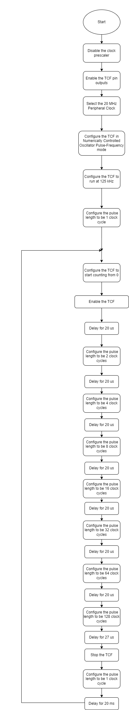

[](https://www.microchip.com)

## Generate Two Constant On-Time PWM Signals in NCO-Pulse Length Mode Using the TCF

The example shows how to set the TCF to generate two Constant-On-Time PWM signals.

## Related Documentation
More details and code examples on the AVR16EB32 can be found at the following links:
- [AVR<sup>®</sup> EB Product Page](https://www.microchip.com/en-us/product/AVR16EB32)
- [AVR<sup>®</sup> EB Code Examples on GitHub](https://github.com/microchip-pic-avr-examples?q=AVR16EB32)

## Software Used
- [MPLAB® X IDE v6.15 or newer](https://www.microchip.com/en-us/tools-resources/develop/mplab-x-ide)
- [AVR-Ex DFP-2.7.184 or newer Device Pack](https://packs.download.microchip.com/)
- [MPLAB® XC8 compiler v2.45](https://www.microchip.com/en-us/tools-resources/develop/mplab-xc-compilers/downloads-documentation#XC8)

## Hardware Used
- [AVR<sup>®</sup> EB Curiosity Nano](https://www.microchip.com/en-us/product/AVR16EB32)

## Setup
The AVR16EB32 Curiosity Nano Development Board is used as a test platform.
<br>

## Functionality
<br>After the peripheral clock and TCF are initialized, the  ```NCO_Pulse_Length_Demo``` function is called in an infinite loop.

This function changes the pulse length of the waveform that the timer outputs on the pin. The timer starts running with a pulse length of 2 clock cycles, and continues to run until it reaches 128 clock cycles.

1 clock cycle takes 50 ns beacuse the timer is running at 20 MHz. 1 divided by 20 MHz equals 50 ns.

At the end the timer is stopped and the pulse length is reset to 1 clock cycle.

```
void NCO_Pulse_Length_Demo(void)
{
    /* Configure the TCF to start counting from 0 */
    TCF0_CounterSet(0); 
    
    /* Enable the TCF */
    TCF0_Start(); 
    
    /* Delay for 20 us */
   _delay_us(20);
   
   /* Configure the pulse-length to 2 clock cycles */
   TCF0_NCO_PulseLengthSet(TCF_WGPULSE_CLK2_gc);
   
   /* Delay for 20 us */
   _delay_us(20);
   
   /* Configure the pulse-length to 4 clock cycles */
   TCF0_NCO_PulseLengthSet(TCF_WGPULSE_CLK4_gc);
   
   /* Delay for 20 us */
   _delay_us(20);
   
   /* Configure the pulse-length to 8 clock cycles */
   TCF0_NCO_PulseLengthSet(TCF_WGPULSE_CLK8_gc);
   
   /* Delay for 20 us */
   _delay_us(20);
   
   /* Configure the pulse-length to 6 clock cycles */
   TCF0_NCO_PulseLengthSet(TCF_WGPULSE_CLK16_gc);
   
   /* Delay for 20 us */
   _delay_us(20);
   
   /* Configure the pulse-length to 32 clock cycles */
   TCF0_NCO_PulseLengthSet(TCF_WGPULSE_CLK32_gc);
   
   /* Delay for 20 us */
   _delay_us(20);
   
   /* Configure the pulse-length to 64 clock cycles */
   TCF0_NCO_PulseLengthSet(TCF_WGPULSE_CLK64_gc);
   
   /* Delay for 20 us */
   _delay_us(20);
   
   /* Configure the pulse-length to 128 clock cycles */
   TCF0_NCO_PulseLengthSet(TCF_WGPULSE_CLK128_gc);
   
   /* Delay for 27 us */
   _delay_us(27);
   
   /* Stop the timer */
   TCF0_Stop();
   
   /* Configure the pulse-length to 1 clock cycle */
   TCF0_NCO_PulseLengthSet(TCF_WGPULSE_CLK1_gc);
}

```
<br>


## Operation
 1. Connect the board to the PC.

 2. Open the  **TCF_NCO_Fixed_Duty_Cycle.X** solution in MPLAB X IDE.

 3. Right click on the project and select **Set as main project**.

<br>

 4. Build the  **TCF_NCO_Fixed_Duty_Cycle.X**  project: click on **Clean and Build Project**.

<br>

 5. Program the project to the board: click on **Make and Program Device**.

<br>


## Results

The logic analyzer capture below show how the TCF generates a waveform signal in NCO Pulse-Length mode.

<br>Result: TCF is used to generate two PWM output signals with a frequency of 125 kHz and with variable duration ranging from 1 clock cycle up to 128 clock cycles.

<br>


## Summary

This example shows how to create a bare metal project using the TCF peripheral of ARVR16EB32. The TCF was configured to generate two PWM output signals on the default TCF output pins (PA0 and PA1). The pulse length varies between 1 clock cycle and 128 clock cylces. The measured output confirms the expected result.